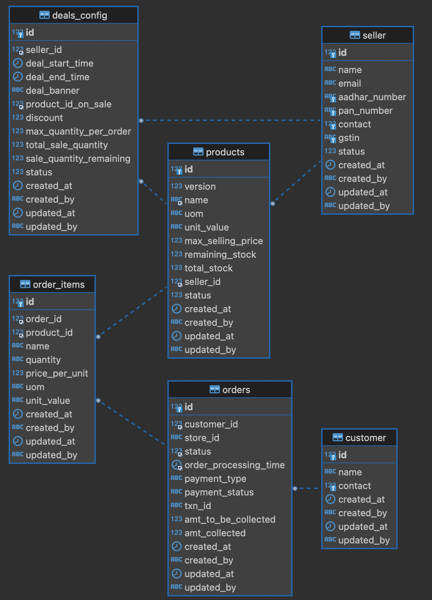

#  <br> Allen Digital | Senior Software Engineer (SDE 3) (May-2024)
## BarRaiser | Machine Coding Round
### [Problem Statement - Limited Time Deals](problem.text)
You are a budding entrepreneur who devised an idea to build an e-commerce giant like Amazon, Flipkart, Walmart, etc. As part of this ambition, you want to build a platform to duplicate the concept of Limited Time Deals.
<br>
A limited-time deal implies that a seller will put up an item on sale for a limited period, for example - 2 hours, and will keep a maximum limit on the number of items that would be sold as part of that deal.<br>
Users cannot buy the deal if the deal time is over.<br>
Users cannot buy if other users have already bought all the items in the deal.<br>
Users can buy up to one item as part of the deal.<br>
<br>
The task is to create APIs to enable the following operations<br>
Create a deal with the price, end time(optional) and number of items to be sold as part of the deal.<br>
End a deal.<br>
Update a deal to increase the number of items or end-time.<br>
Claim a deal (Basically, creating an order. No need to take care of item price or payment).<br>

### Guidelines
Document and communicate your assumptions in README.<br>
Create a working solution with production-quality code.<br>
Use an external database like Postgres/MySQL or any NoSQL database<br>
Define and Create APIs to support the operations mentioned above<br>
Write a few unit tests for the most important code<br>

What are we looking for?<br>
Your approach to the solution<br>
How you write code in terms of readability and maintainability<br>
Usage of best practices<br>
Testing skills<br>
<br>
You are expected to write code for the complete application and build at least one end-to-end feature. However, a complete working solution is NOT expected.

### Low Level Design



### How to build & run project 
  - Build commands 
    ```shell
    ruchirgupta@Ruchirs-MacBook-Pro demo-service % mvn clean install package -DskipTests && mvn spring-boot:run
    ```
  - Run with specific profile
    ```shell
    ruchirgupta@Ruchirs-MacBook-Pro demo-service % mvn clean install package -DskipTests
    ruchirgupta@Ruchirs-MacBook-Pro demo-service % mvn spring-boot:run -Dspring-boot.run.profiles=local
    ruchirgupta@Ruchirs-MacBook-Pro demo-service % mvn spring-boot:run -Dspring-boot.run.profiles=dev
    ruchirgupta@Ruchirs-MacBook-Pro demo-service % mvn spring-boot:run -Dspring-boot.run.profiles=qa
    ruchirgupta@Ruchirs-MacBook-Pro demo-service % mvn spring-boot:run -Dspring-boot.run.profiles=prod
    ```
  - Build commands with jar
    ```shell
    ruchirgupta@Ruchirs-MacBook-Pro demo-service % mvn clean install package -DskipTests
    ruchirgupta@Ruchirs-MacBook-Pro demo-service % java -jar target/demo-service-1.0-SNAPSHOT.jar
    ruchirgupta@Ruchirs-MacBook-Pro demo-service % java -jar -Dspring.profiles.active=local target/demo-service-1.0-SNAPSHOT.jar
    ruchirgupta@Ruchirs-MacBook-Pro demo-service % java -jar -Dspring.profiles.active=dev target/demo-service-1.0-SNAPSHOT.jar
    ruchirgupta@Ruchirs-MacBook-Pro demo-service % java -jar -Dspring.profiles.active=qa target/demo-service-1.0-SNAPSHOT.jar
    ruchirgupta@Ruchirs-MacBook-Pro demo-service % java -jar -Dspring.profiles.active=prod target/demo-service-1.0-SNAPSHOT.jar
    ```
- - -
## Spring-Open Doc (swagger-ui)
- Demo-service swagger
  > Once the application is up, Open the local swagger URL is [Swagger Doc](http://localhost:12024/api/swagger-ui.html)
